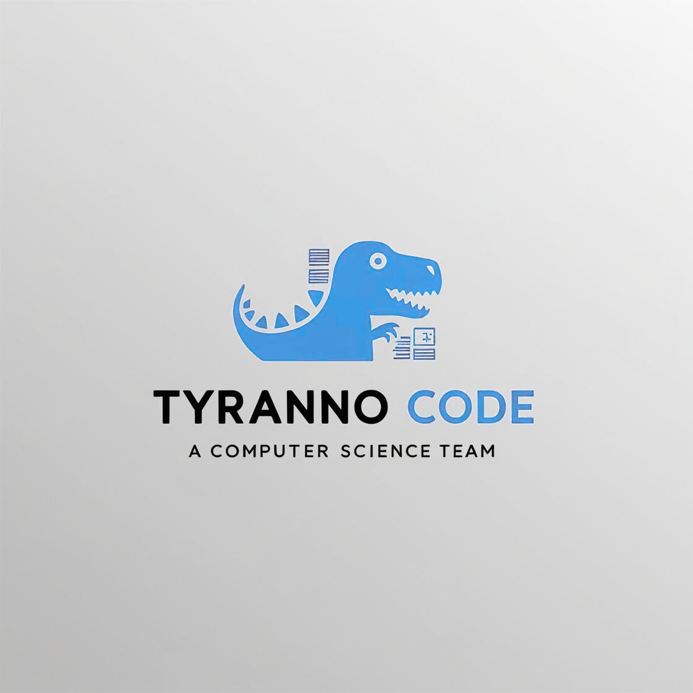

# Tyranno Code

## BankruptcySolutions
"Building a user-friendly landing page for bankruptcy solutions."

## Contributers 

- [Romaine De La Cruz](https://github.com/username)
- [Isaac Thawer](https://github.com/username)
- [Robby Dosanjh](https://github.com/username)
- [Bryan Robare](https://github.com/username)
- [Christopher Flores](https://github.com/username)
- [Alexis Aguilar](https://github.com/username)
- [Goodwin Lu](https://github.com/username)
- [Seyed Mojtaba Karanizadeh](https://github.com/username)

## Description
This project is a professional landing page for Bankruptcy Solutions by Eric Schwab, designed to provide clients with easy access to information and services. The website includes:
*   A homepage summarizing services, featuring the product owner's profile, and a consultation request form for quick submissions.
*   Sections showcasing client reviews, business hours, and a Google map for easy navigation.
*   An "About Us" page with detailed information about Eric Schwab’s background and his law practice.
*   An admin page for securely updating website content and managing client information.

**Technology stack**
* **HTML** (HyperText Markup Language): Structures the content and layout of the website, providing the foundation for all pages.
* **CSS** (Cascading Style Sheets): Styles the website with custom designs, colors, and responsive layouts to ensure a visually appealing and mobile-friendly experience.
* **JavaScript** Adds interactivity, such as form validation, dynamic content updates, and potential animations to enhance the user experience. This will be added in future revisions

## Installation

No current dependencies. You only need a browser to view the landing page
Follow these steps to set up and view the landing page locally:
1. Clone the repository: Download the repository to your computer. You can either use Git or download it as a ZIP file:
    `git clone git@github.com:IsaacThawer/BankruptcySolutions.git `

2. Navigate to the project folder: If you cloned the repository, go to the folder using:
    `cd ~/BankruptcySolutions`

3. Open the landing page: Locate the main HTML file (e.g., index.html) and open it in your preferred web browser. You can do this by:
    + Double-clicking the `index.html` file.
    + Dragging and dropping the file into a browser window.
4. Optional - Use a local server: If you want to serve the page locally (for testing purposes), you can use a simple HTTP server:
    `python -m http.server`
Then, visit http://localhost:8000 in your browser.
Or, use a lightweight server like Live Server in Visual Studio Code.

## Usage

This project provides a professional and user-friendly interface with the following features:

#### Home Page
- Overview of services offered by Eric Schwab.
- Profile summary of the product owner.
- Consultation request form for quick and easy submissions.
- Business hours and a Google map showing the office location.
- Links to review platforms (e.g., Yelp, Google).

#### About Us Page
- Attorney profile with a professional portrait of Eric Schwab.
- Background information about his law practice and philosophy.
- Commitment to clients and approach to service.

#### Services Page
- Detailed descriptions of the services offered.
- Information on how these services benefit potential clients.

#### Testimonials Page
- Displays positive client testimonials and feedback.

#### Admin Page
- Secure, encrypted login for the product owner.
- Features for managing website content:
  - Update text and images on the site.
  - Maintain a modern and professional appearance.
- Secure connection to the SQL database.
- Ability to remove client information after intake appointments.

#### Database and Security Features
- Form submissions are stored securely in an SQL database.
- Ensures data security and compliance for client information.

#### Search Engine Optimization (SEO)
- Keywords and phrases optimized for search engines to attract potential clients.
- Engaging and easy-to-read content.
- User-friendly website structure for better search engine visibility.

## Known issues
- **Browser Compatibility**: The page may not render properly on older versions of Internet Explorer.  
- **Responsive Design**: Some elements may overlap on very small or very large screen sizes.  
- **Limited Testing**: The page has been tested on the latest versions of Chrome, Firefox, and Edge only.  

## Getting help
If you need help with this project, here’s how you can get support:
1. **Documentation:**  
   - Refer to the setup and usage instructions in this `README.md`.

2. **Report an Issue:**  
   - If you encounter bugs or have feature requests, open an issue [here](https://github.com/IsaacThawer/BankruptcySolutions/issues).  
   - Include the following details:
     - A clear description of the problem.
     - Steps to reproduce the issue.
     - Screenshots or code snippets (if applicable).

3. **Contact:**  
   - For direct support, email the [maintainer](mailto:rdelacruz2@csus.edu)

## Final Message

Thank you for taking the time to explore our project!

If you have any feedback or ideas, don’t hesitate to [open an issue](hhttps://github.com/IsaacThawer/BankruptcySolutions/issues) or reach out. Contributions are greatly appreciated, whether big or small!  

If you liked this project, please consider giving it a **star**, it helps!  

Stingers up!

