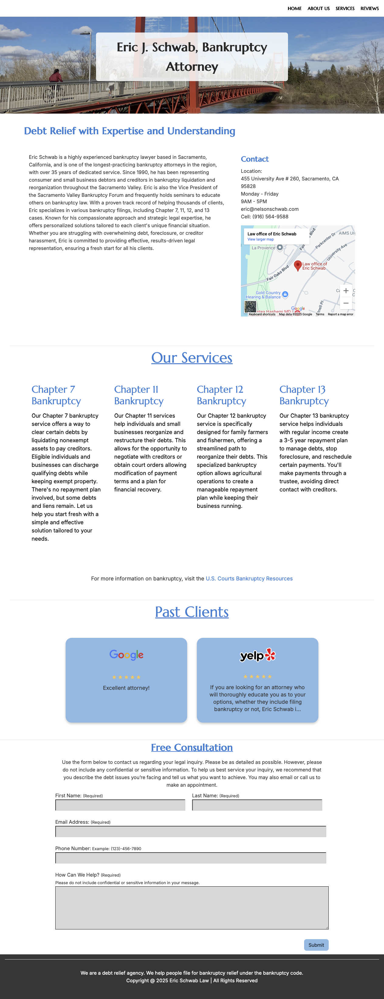
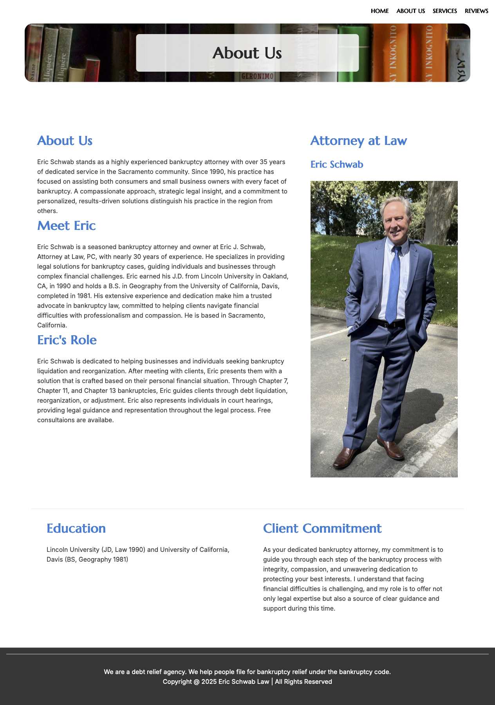
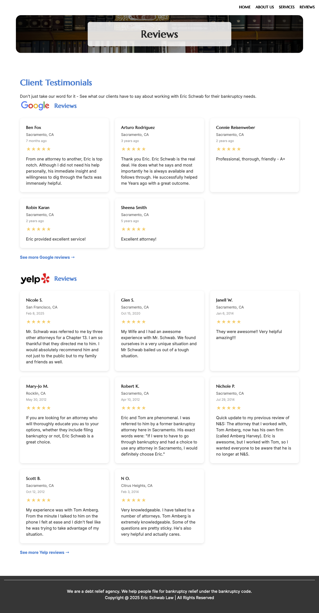
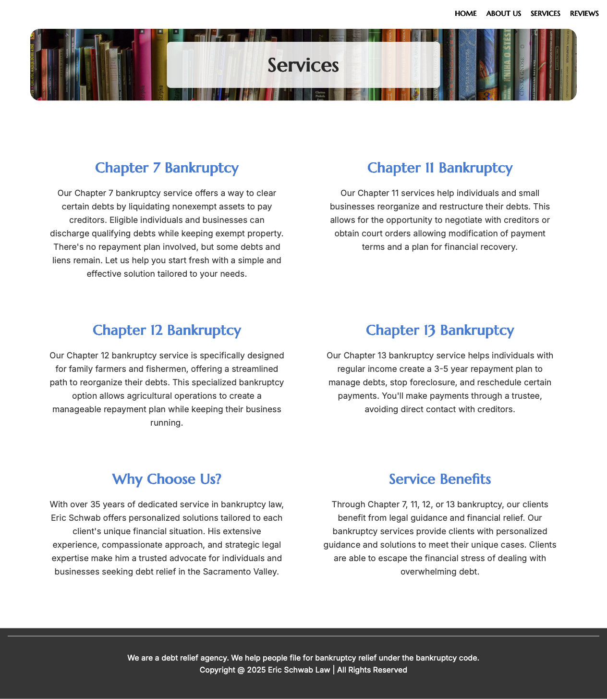
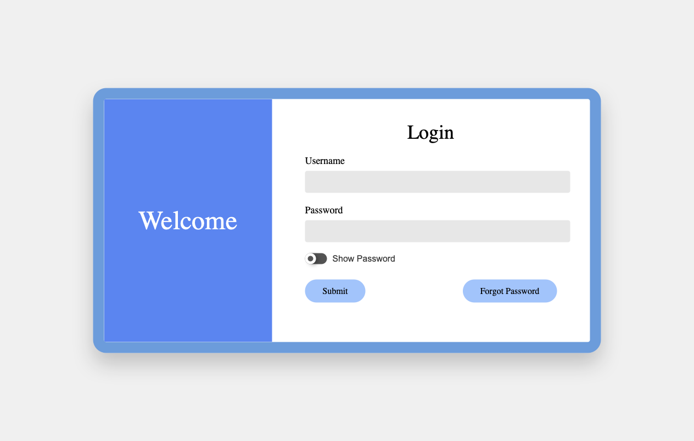
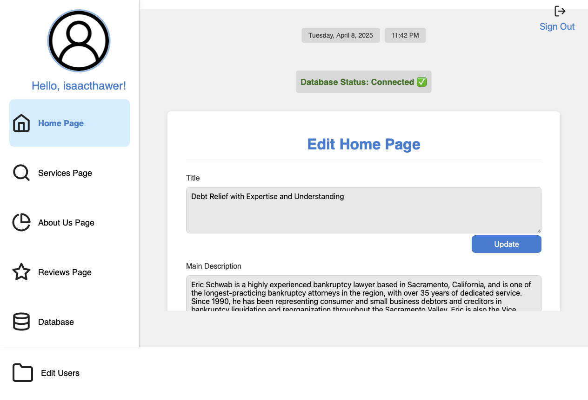
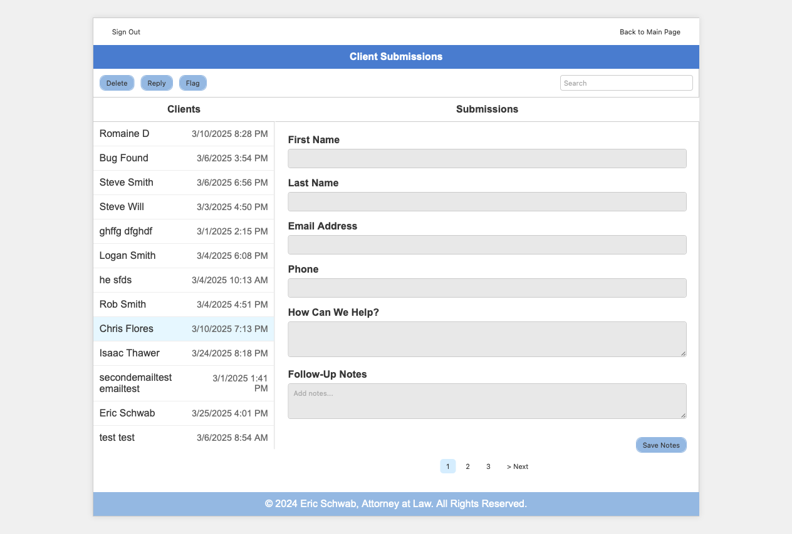

# Tyranno Code


## BankruptcySolutions
"Building a user-friendly landing page for bankruptcy solutions."

## Main Contributors 

- [Romaine De La Cruz](https://github.com/r2dcruz)
- [Isaac Thawer](https://github.com/IsaacThawer)
- [Robby Dosanjh](https://github.com/RobbyS3)
- [Bryan Robare](https://github.com/BryTheGuy98)
- [Christopher Flores](https://github.com/ChristopherFl)
- [Alexis Aguilar](https://github.com/MazatheGoD)
- [Goodwin Lu](https://github.com/KirinBlade)
- [Seyed Mojtaba Karanizadeh](https://github.com/skaranizadeh)

## Prototype UI
### Home Page


### About Us Page


### Testimonials Page


### Services Page


### Login Page


### Admin Dashboard


### Admin Database


## Description
This project is a professional landing page for Bankruptcy Solutions by Eric Schwab, designed to provide clients with easy access to information and services. The website includes:
*   A homepage summarizing services, featuring the product owner's profile, and a consultation request form for quick submissions.
*   Sections showcasing client reviews, business hours, and a Google map for easy navigation.
*   An "About Us" page with detailed information about Eric Schwab’s background and his law practice.
*   An admin page for securely updating website content and managing client information.


**Technology stack**
* **HTML** (HyperText Markup Language): Structures the content and layout of the website, providing the foundation for all pages.
* **CSS** (Cascading Style Sheets): Styles the website with custom designs, colors, and responsive layouts to ensure a visually appealing and mobile-friendly experience.
* **JavaScript** Adds interactivity, such as form validation, dynamic content updates, and animations to enhance the user experience.

## Getting Started

npm is required for this project. Please do the following to see if you have npm installed
```
npm -v
```
If you have an older version or you want the latest update, please check out [npm website](https://docs.npmjs.com/cli/v8/commands/) and proceed with the command   
```
npm install
```
Follow these steps to set up and view the landing page locally:
1. Clone the repository: Download the repository to your computer. You can either use Git or download it as a ZIP file:
    ```
    git clone git@github.com:IsaacThawer/BankruptcySolutions.git 
    ```

2. Navigate to the project folder: If you cloned the repository, go to the folder using:
    ```
    cd ~/BankruptcySolutions
    ```

3. Open the landing page: Locate the main HTML file (e.g., index.html) and open it in your preferred web browser. You can do this by:
    + Double-clicking the `index.html` file.
    + Dragging and dropping the file into a browser window.
4. Optional - Use a local server: If you want to serve the page locally (for testing purposes), you can use a simple HTTP server:
    ```
    python -m http.server
    ```
Then, visit http://localhost:8000 in your browser.
Or, use a lightweight server like Live Server in Visual Studio Code.

  ` Some of the core JavaScript functionality will not work due to the lack of the .env file `
## Usage

This project provides a professional and user-friendly interface with the following features:

#### Home Page
- Overview of services offered by Eric Schwab.
- Profile summary of the product owner.
- Consultation request form for quick and easy submissions.
- Business hours and a Google map showing the office location.
- Links to review platforms (e.g., Yelp, Google).

#### About Us Page
- Attorney profile with a professional portrait of Eric Schwab.
- Background information about his law practice and philosophy.
- Commitment to clients and approach to service.

#### Services Page
- Detailed descriptions of the services offered.
- Information on how these services benefit potential clients.

#### Testimonials Page
- Displays positive client testimonials and feedback from Google and Yelp.

#### Login Page
- Secure, encrypted login for the product owner with implementation of AWS Cognito.
- Show password functionality.
- Forgot password functionality with email delivery for account recovery.
- Captcha is implemented if failed attempts exceed 3.

#### Admin Dashboard
- Secure, encrypted login for the product owner with implementation of AWS Cognito.
- Features for managing website content:
  - Update text and images on the site.
  - Maintain a modern and professional appearance.
  - Add or remove users' access privileges to the Admin Dashboard.
  - Show the current time.
  - Add a personal profile picture that is stored on the computer's local storage.
  - Role-based Admin Control for Admin and Editor users.

#### Client Submissions Page
- Secure connection to the NoSQL database.
- Ability to remove client information after intake appointments.
- Ability to search, flag, and reply to the submissions within the DynamoDB Database.


#### Search Engine Optimization (SEO)
- Keywords and phrases within metadata are optimized for search engines to attract potential clients.
- Engaging and easy-to-read content.
- User-friendly website structure for better search engine visibility.


## Known issues
- **Browser Compatibility**: The page may not render properly on older versions of Internet Explorer.  
- **Mobile Device Performance**: The page elements are optimized for a mobile device platform. Some images do not load preemptively.
- **Responsive Design**: Some elements may load previous html version until JavaScript code is fetched from server.  
- **Limited Testing**: The page has been tested on the latest versions of Chrome, Safari, and Edge only.  

## Testing

- **Unit Testing:** 
Unit Testing is done by JEST for individual components and functions. 
- **Integration Testing:** 
Integration Testing by Selenium to verify interactions between different modules.
- **UI/UX Testing:** 
UI/UX Testing was done with tools like Google Lighthouse to ensure best practices
- **Tools Used:** 
    * Jest
    * Selenium
    * ChromeDevTools and Lighthouse

## Deployment
Steps for deploying the project to a live server:
- **Local Deployment:** 
1. Clone the repository using  `git clone https://github.com/IsaacThawer/BankruptcySolutions.git`.
2. Run command `cd BankruptcySolutions` to navigate into proper folder .
3. Install all the dependencies from commands found in the howtorun.txt file .
4. Create env file with all variables needed within source code i.e. Cognito_pool_ID, Client_ID, REGION, and so forth.
5. Create a node.js instance by running ` node server.js` and visit http://localhost:8000 .
- **Cloud Deployment:** 
1. SSH into server ip, with command ` ssh root@server-ip`(server-ip has to be specific to server used).
2. Clone the repository using  `git clone https://github.com/IsaacThawer/BankruptcySolutions.git` .
3. Run command `cd BankruptcySolutions` to navigate into proper folder.
4. Run command  ` apt update && apt install nodejs npm -y` (may need to use sudo in front of apt).
5. Install all the dependencies from commands found in the howtorun.txt file.
6. Configure .env file to use all process.env variables within the source code.
7. Install PM2, and start the process manager.
    * Run the following commands in the remote server:
        1. `npm install -g pm2`
        2. ` pm2 start server.js`
        3. ` pm2 save`
        4. ` pm2 startup`
8. Install Nginx to create a reverse proxy.
    * Run the following commands in the remote server:  
        1.  `sudo apt install nginx -y`  
        2.  `sudo nano /etc/nginx/sites/default`  
            * Within the nano editor, put the following code:

            ```nginx
            server {
                listen 80;
                server_name yourdomain.com;

                location / {
                    proxy_pass http://localhost:800;
                    proxy_http_version 1.1;
                    proxy_set_header Upgrade $http_upgrade;
                    proxy_set_header Connection 'upgrade';
                    proxy_set_header Host $host;
                    proxy_cache_bypass $http_upgrade;
                }
            }
            ```
        3. Run sudo nginx -t .
        4. Run sudo systemctl restart nginx .
 * SSL Certificates require a different nginx file configuration; more documentation can be found here "https://nginx.org/en/docs/http/configuring_https_servers.html" .
## Developer Instructions
This section is intended to guide developers contributing to the project. Future updates will include:
- **Code Style Guidelines:**
[Google HTML/CSS Style Guide](https://google.github.io/styleguide/htmlcssguide.html) is the code flow for the code stack
- **Branching Strategy:**
Start by creating a testing branch
```
git checkout -b <branch name>
```
- **Testing Requirements:**
We follow JEST guidelines in testing our codes and codes >85% or more are accepted
- **Contribution Guidelines:** 
Contributions are always welcome! Please star, fork, push, and create a pull request!


## Getting help
If you need help with this project, here’s how you can get support:
1. **Documentation:**  
   - Refer to the setup and usage instructions in this `README.md`.

2. **Report an Issue:**  
   - If you encounter bugs or have feature requests, open an issue [here](https://github.com/IsaacThawer/BankruptcySolutions/issues).  
   - Include the following details:
     - A clear description of the problem.
     - Steps to reproduce the issue.
     - Screenshots or code snippets (if applicable).

3. **Contact:**  
   - For direct support, email the [maintainer](mailto:rdelacruz2@csus.edu)

## Timeline
The following timeline outlines the expected milestones of the project:

- **Sprint 1-2:** Initial project setup and development of the homepage.
- **Sprint 3-4:** Implementation of About Us, Services, and Testimonials pages.
- **Sprint 5-6:** Admin page development and testing.
- **Sprint 7:** Database integration for the consultation form and Admin database.
- **Sprint 8:** Final testing, search engine optimization, bug fixes, and deployment.

This timeline is based on the JIRA backlog and user stories.

## Final Message

Thank you for taking the time to explore our project!

If you have any feedback or ideas, don’t hesitate to [open an issue](hhttps://github.com/IsaacThawer/BankruptcySolutions/issues) or reach out. Contributions are greatly appreciated, whether big or small!  

If you liked this project, please consider giving it a **star**, it helps!  

Stingers up!

